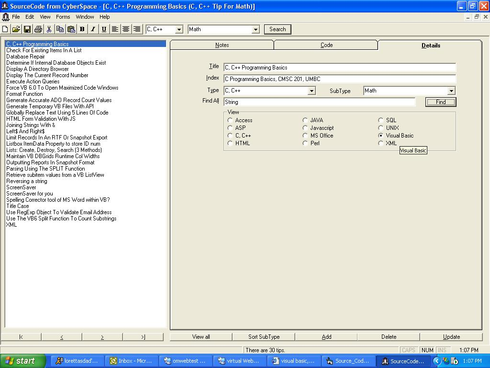



## Source Code Toolbox

### Description

A developers source code database. I built this application as an intermediate project for building a complete application. It illustrates design and human computer interaction techniques, as well as a fully functioning VB app banging on an Access database.
 
### More Info
 
I built this originally in VB5/6 a dogs age ago '99-00 & never posted it on PSC. I dusted this off last week & found a lot of the code examples still relavent. I hope you find some of code useful.

Tons of comments, lots of modules for you to use & abuse.

Let me know what you think.

Being able to store & retrieve your source code more rapidly may increase your salary, enhance your reputation among co-workers and make you more desirable to the opposite sex (or the same sex if that's your thing).

             |
---                |---
**Submitted On**   |2002-05-03 14:50:26
**By**             |[James Fleming](https://github.com/Planet-Source-Code/PSCIndex/blob/master/ByAuthor/james-fleming.md)
**Level**          |Intermediate
**User Rating**    |4.9 (44 globes from 9 users)
**Compatibility**  |VB 5\.0, VB 6\.0
**Category**       |[Complete Applications](https://github.com/Planet-Source-Code/PSCIndex/blob/master/ByCategory/complete-applications__1-27.md)
**World**          |[Visual Basic](https://github.com/Planet-Source-Code/PSCIndex/blob/master/ByWorld/visual-basic.md)
**Archive File**   |[VB\_Tips\_ap78951532002\.zip](https://github.com/Planet-Source-Code/james-fleming-source-code-toolbox__1-34420/archive/master.zip)

